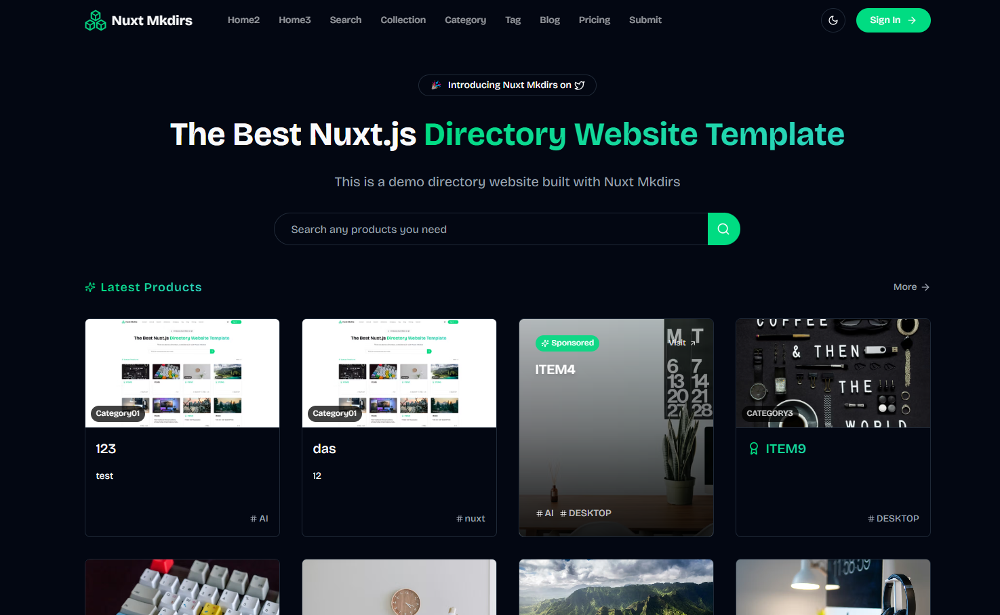
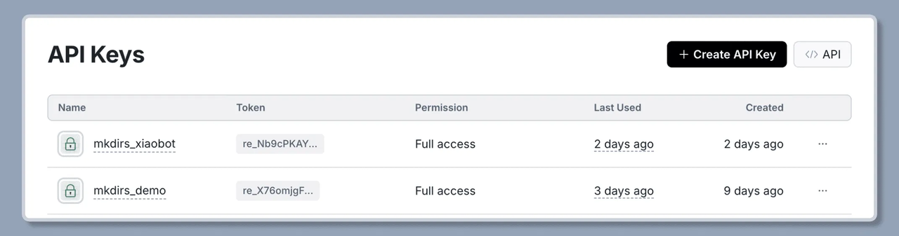
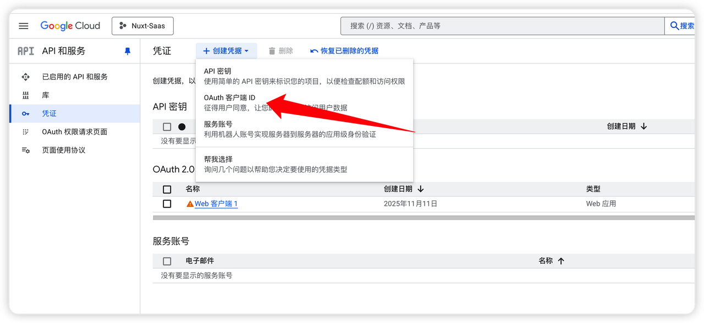
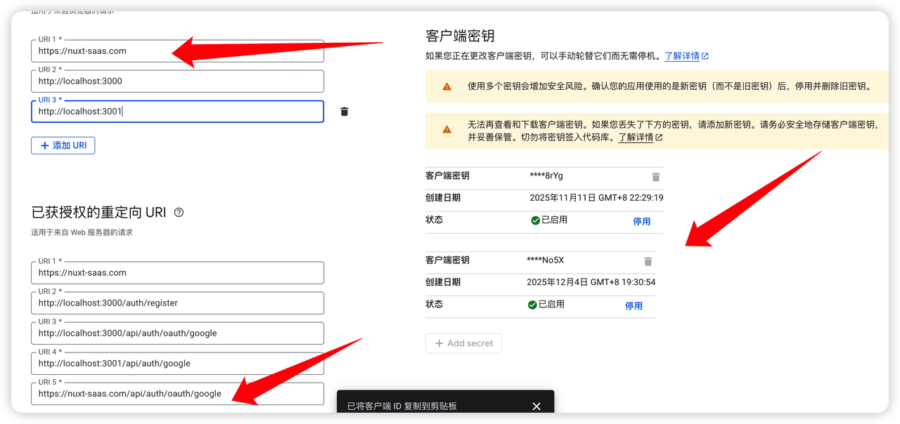

<div align="center">


# Nuxt Mkdirs

**Open-source directory website template built with Nuxt 4**

[Live Demo](https://demo.nuxt-mkdirs.com) · 

</div>

---

## ✨ Features

- 🎨 **3 Homepage Layouts** - Multiple styles, ready to use out of the box
- 📦 **Sanity CMS** - Headless CMS, no database configuration needed
- 🔐 **Multiple Auth Methods** - Google / GitHub OAuth login
- 💳 **Payment Integration** - Supports Stripe and Creem
- 📧 **Email Service** - Resend for transactional emails + Newsletter
- 🤖 **AI Integration** - Supports Google AI / DeepSeek / OpenAI
- 🌙 **Dark Mode** - Auto-follows system theme
- 📱 **Responsive Design** - Perfect mobile adaptation
- ⚡ **NuxtHub Deploy** - One-click deploy to Cloudflare

## 📸 Screenshot



## 🛠️ Tech Stack

| Category | Technology |
|----------|------------|
| Framework | Nuxt 4, Vue 3 |
| Styling | TailwindCSS 4, Radix Vue |
| CMS | Sanity |
| Auth | Auth.js |
| Payment | Stripe, Creem |
| Email | Resend |
| Deploy | NuxtHub (Cloudflare) |

## 🚀 Quick Start

### Prerequisites

- Node.js 18+
- pnpm 8+

### Installation

```bash
# Clone the repository
git clone https://github.com/your-username/nuxt-mkdirs.git
cd nuxt-mkdirs

# Install dependencies
pnpm install

# Copy environment variables
cp .env.example .env

# Start development server
pnpm dev
```

Visit http://localhost:3000 to see the result.

### Build & Deploy

```bash
# Build for production
pnpm build

# Preview locally
pnpm preview
```

## ⚙️ Configuration Guide

### 1. Sanity CMS Setup

Nuxt Mkdirs uses [Sanity](https://www.sanity.io/) as a headless CMS to manage all content data.

1. Create a [Sanity account](https://www.sanity.io/signup)
2. Create a new project and get the Project ID
3. Create an API Token (select Editor permission)
4. Configure CORS origins


```bash
# .env configuration
NUXT_PUBLIC_SANITY_PROJECT_ID=your_project_id
NUXT_PUBLIC_SANITY_DATASET=production
NUXT_SANITY_API_TOKEN=your_api_token
```

5. Deploy Sanity Studio

```bash
pnpm dlx sanity deploy
```


### 2. Email Setup (Resend)

1. Create a [Resend account](https://resend.com/)
2. Add and verify your domain
3. Create an API Key



4. Configure Audience ID (for Newsletter)


```bash
# .env configuration
NUXT_RESEND_API_KEY=re_xxxxx
NUXT_RESEND_EMAIL_FROM=noreply@yourdomain.com
NUXT_RESEND_AUDIENCE_ID=xxxxx
```

### 3. Payment Setup

#### Stripe (International)

```bash
NUXT_STRIPE_SECRET_KEY=sk_xxxxx
NUXT_STRIPE_WEBHOOK_SECRET=whsec_xxxxx
NUXT_PUBLIC_STRIPE_PUBLISHABLE_KEY=pk_xxxxx
```

#### Creem (China-friendly)

[Creem](https://creem.io/) supports registration with Chinese ID, more friendly for Chinese developers.

```bash
NUXT_CREEM_API_KEY=xxxxx
NUXT_CREEM_WEBHOOK_SECRET=xxxxx
NUXT_CREEM_TEST_MODE=true
NUXT_PUBLIC_CREEM_PRO_PRODUCT_ID=xxxxx
```

### 4. OAuth Authentication Setup

#### Google OAuth

1. Visit [Google Cloud Console](https://console.cloud.google.com/apis/credentials)
2. Create an OAuth Client ID





```bash
# .env configuration
NUXT_AUTH_GOOGLE_CLIENT_ID=xxxxx
NUXT_AUTH_GOOGLE_CLIENT_SECRET=xxxxx
```

#### GitHub OAuth

1. Visit [GitHub Developer Settings](https://github.com/settings/developers)
2. Create an OAuth App

```bash
NUXT_AUTH_GITHUB_CLIENT_ID=xxxxx
NUXT_AUTH_GITHUB_CLIENT_SECRET=xxxxx
```

#### Auth Secret

```bash
# Generate secret
openssl rand -base64 32

# .env configuration
NUXT_AUTH_SECRET=your_generated_secret
```

### 5. AI Configuration (Optional)

```bash
# Choose AI provider: google, deepseek, openai
NUXT_AI_PROVIDER=google

# Google AI
NUXT_GOOGLE_AI_API_KEY=xxxxx

# DeepSeek
NUXT_DEEPSEEK_API_KEY=xxxxx

# OpenAI
NUXT_OPENAI_API_KEY=xxxxx
```

## 📁 Project Structure

```
nuxt-mkdirs/
├── app/
│   ├── components/     # Vue components
│   ├── composables/    # Composables
│   ├── layouts/        # Layout components
│   ├── pages/          # Page routes
│   └── utils/          # Utility functions
├── server/
│   ├── api/            # API routes
│   └── utils/          # Server utilities
├── sanity/
│   └── schemas/        # Sanity schemas
└── public/             # Static assets
```

## 🤝 Contributing

Contributions are welcome! Please read the [Contributing Guide](CONTRIBUTING.md).

1. Fork the repository
2. Create your feature branch (`git checkout -b feature/AmazingFeature`)
3. Commit your changes (`git commit -m 'Add some AmazingFeature'`)
4. Push to the branch (`git push origin feature/AmazingFeature`)
5. Open a Pull Request

## 📄 License

This project is licensed under the [MIT](LICENSE) License.

## 💖 Support

If this project helps you, please consider:

- ⭐ Give it a Star
- 🐛 Submit Issues
- 📢 Share with others
<!-- - ☕ [Buy me a coffee](https://github.com/sponsors/your-username) -->

## 📮 Contact

<!-- - WeChat: w314709923x -->
- GitHub: [@PBHAHAHA](https://github.com/PBHAHAHA)

---

<div align="center">
  Made with ❤️ by <a href="https://github.com/PBHAHAHA">PBHAHAHA</a>
</div>
